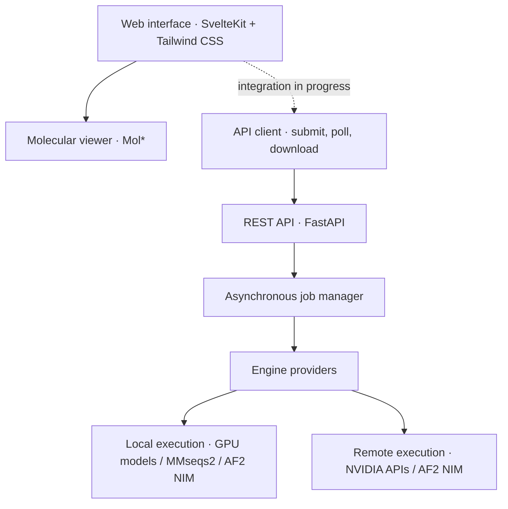

<div align="center">

# Protein Platform

**Protein and molecular workflows, connected.**

Structure prediction · Molecular docking · Sequence search · Molecule generation

[](LICENSE)
[](backend/pyproject.toml)
[](frontend/package.json)

**English** · [简体中文](README.zh-CN.md) · [日本語](README.ja.md)

[Quick start](#quick-start) · [Features](#features) · [API](#api) · [Architecture](#architecture) · [Contributing](#contributing)

</div>

---

Protein Platform brings protein and small-molecule tools together behind a shared API and web interface. Run supported engines on local hardware or use NVIDIA hosted APIs, with a consistent workflow for submitting jobs, tracking progress, and retrieving results.

- **A shared job API.** Generation, optimization, docking, search, and folding use the same asynchronous task lifecycle.
- **Flexible execution.** Configure providers per engine, with local-first selection when both providers are available.
- **Clear engine diagnostics.** Check dependencies, model weights, API credentials, and GPU information through one health endpoint. An unavailable engine does not prevent the service from starting.
- **Molecular visualization.** Inspect protein structures and ligands together in the browser with Mol*.

## Features

| Workflow | Engine | Local execution | Hosted API |
| :--- | :--- | :--- | :--- |
| Molecule generation | GenMol | Implemented · GPU | Implemented |
| Molecule optimization | MolMIM | Planned | Implemented |
| Molecular docking | DiffDock | Implemented · GPU | Implemented |
| Sequence search | MMseqs2 | Implemented · CPU | — |
| Structure prediction | AlphaFold 2 | NIM service adapter | Remote NIM service adapter¹ |
| Structure and ligand visualization | Mol* | Browser | — |

¹ AlphaFold 2 requires a separately deployed NIM service. NVIDIA’s public AF2 endpoint is deprecated; configure an explicit local or remote address. See the [AlphaFold 2 setup guide](docs/alphafold2.md). Local engines require their dependencies and model assets; hosted engines require API access. End-to-end validation across all provider configurations is still pending.

**Web interface status:** the Mol* viewer is integrated. Inference pages currently use sample data; connecting them to the backend is on the [roadmap](#roadmap). Use the REST API below to submit inference jobs.

## Quick start

You will need **Git**, **Python 3.11+**, **uv**, and **Node.js with npm**. The web service can start without GPU dependencies. Hosted GenMol, MolMIM, and DiffDock inference requires an NVIDIA API key with access to the selected model. AlphaFold 2 uses a [separately configured NIM service](docs/alphafold2.md).

### 1. Clone and configure

```bash
git clone https://github.com/HiroGitea/protein-platform.git
cd protein-platform
cp backend/.env.example backend/.env
cp frontend/.env.example frontend/.env
```

For hosted inference, set the following in `backend/.env` using a key from [NVIDIA Build](https://build.nvidia.com):

```dotenv
NVIDIA_API_KEY=your-api-key
```

Provider selection defaults to `auto`: a ready local provider is preferred; otherwise, the engine checks its hosted provider. See [provider configuration](#provider-configuration) to choose explicitly.

### 2. Start the backend

From the repository root:

```bash
cd backend
uv sync
uv run uvicorn app.main:app --reload --port 8000
```

| Resource | URL |
| :--- | :--- |
| Interactive API documentation | http://127.0.0.1:8000/docs |
| GPU and engine diagnostics | http://127.0.0.1:8000/api/health |

### 3. Start the frontend

In a second terminal, from the repository root:

```bash
cd frontend
npm install
npm run dev
```

Open **http://localhost:5173**. The backend URL is configured through `VITE_API_BASE` in `frontend/.env`.

## API

Every inference request returns a `job_id`. Poll the job to track progress, then download its output files once its status is `succeeded`.

```bash
# Submit a molecule-generation job.
curl -X POST http://127.0.0.1:8000/api/genmol/generate \
  -H 'Content-Type: application/json' \
  -d '{"mode":"denovo","num_samples":10}'

# Replace this value with the job_id returned above.
JOB_ID=your-job-id

# Inspect status, progress, errors, and output file URLs.
curl "http://127.0.0.1:8000/api/jobs/$JOB_ID"

# Download after the job succeeds.
curl -fO "http://127.0.0.1:8000/api/jobs/$JOB_ID/files/molecules.smi"
```

Jobs move from `queued` to `running`, then finish as `succeeded`, `failed`, or `cancelled`. A submission response acknowledges the job; check its final status for the inference result.

<details>
<summary><strong>Endpoint reference</strong></summary>

| Method | Endpoint | Purpose |
| :--- | :--- | :--- |
| `GET` | `/api/health` | GPU information and engine readiness |
| `POST` | `/api/files` | Upload input files, including PDB, SDF, and FASTA |
| `POST` | `/api/genmol/generate` | Generate molecules |
| `POST` | `/api/molmim/optimize` | Optimize molecules |
| `POST` | `/api/diffdock/dock` | Dock a ligand to a protein |
| `POST` | `/api/mmseqs/search` | Search a sequence database |
| `POST` | `/api/fold/predict` | Predict a protein structure |
| `GET` | `/api/jobs/{job_id}` | Read job status and results |
| `POST` | `/api/jobs/{job_id}/cancel` | Request job cancellation |
| `GET` | `/api/jobs/{job_id}/files/{filename}` | Download an output file |

Request schemas are available in the backend's [interactive API docs](http://127.0.0.1:8000/docs). The [TypeScript client](frontend/src/lib/api/client.ts) provides helpers for submission, polling, uploads, and downloads.

</details>

## Provider configuration

Choose a provider independently for each engine in `backend/.env`:

```dotenv
PROTEIN_GENMOL_PROVIDER=auto
PROTEIN_MOLMIM_PROVIDER=remote
PROTEIN_DIFFDOCK_PROVIDER=auto
PROTEIN_FOLD_PROVIDER=auto
PROTEIN_MMSEQS_PROVIDER=local
```

| Value | Selection behavior |
| :--- | :--- |
| `auto` | Prefer a ready local provider; otherwise select a ready hosted provider |
| `local` | Use only the local provider |
| `remote` | Use only the hosted provider |

Selection happens before inference; `auto` does not retry a failed local job remotely. Restart the backend after changing configuration, then inspect `/api/health` for readiness and missing requirements.

<details>
<summary><strong>Local setup: GenMol, DiffDock, and MMseqs2</strong></summary>

Run these commands from the repository root. Model source, weights, and databases are acquired separately from the core web dependencies.

**GenMol**

```bash
./scripts/setup-genmol.sh
uv sync --directory backend --group genmol
```

Download the checkpoint using the sources printed by the setup script and place it at `backend/checkpoints/model_v2.ckpt`.

**DiffDock**

```bash
./scripts/setup-diffdock.sh
uv sync --directory backend --group diffdock
```

Follow the setup script's notes for matching PyTorch Geometric dependencies. The first inference may download additional model assets.

When enabling both engines, include both groups in subsequent sync commands so their dependencies remain installed:

```bash
uv sync --directory backend --group genmol --group diffdock
```

**MMseqs2 — CPU sequence search**

The bundled binary installer targets Linux x86_64. With the installed binary on `PATH`, build a search database:

```bash
./scripts/setup-mmseqs.sh
export PATH="$PWD/backend/third_party/bin:$PATH"
./scripts/build-mmseqs-db.sh swissprot
```

Start the backend from a terminal with this `PATH`, or set `PROTEIN_MMSEQS_BINARY` to the binary's absolute path in `backend/.env`.

**GPU configuration**

The repository's GPU dependency groups use `torch>=2.7` from the CUDA 12.8 wheel index. The documented development machine has an RTX 5070 Ti with 16 GB VRAM and 64 GB RAM; memory requirements vary by engine and input. Jobs run one at a time by default (`PROTEIN_MAX_CONCURRENT_JOBS=1`).

</details>

## Architecture



GPU dependencies are loaded on demand, keeping the web service independent of local model installation. Each engine exposes its own readiness checks and returns results through the shared job interface.

## Project structure

```text
protein-platform/
├── backend/      FastAPI service, engine providers, and job management
├── frontend/     SvelteKit interface, API client, and Mol* viewer
├── scripts/      Model source, binary, and database setup
└── docs/         Model background and reference material
```

See the [backend guide](backend/README.md) and [frontend guide](frontend/README.md) for implementation details. These guides are currently in Chinese.

## Roadmap

- [x] Asynchronous job API, file uploads, and engine diagnostics
- [x] Local and hosted providers for GenMol and DiffDock
- [x] Hosted MolMIM provider and local MMseqs2 search
- [x] Mol* viewer and shared TypeScript API client
- [ ] Connect inference pages to the backend and replace sample data
- [x] Integrate AlphaFold 2 through local and remote NIM services
- [ ] Implement local MolMIM optimization
- [ ] Add user authentication and persistent job history

## Contributing

Contributions are welcome, including engine integrations, frontend work, documentation, and bug fixes. See [CONTRIBUTING.md](CONTRIBUTING.md) for setup instructions and checks (currently in Chinese).

When reporting an engine issue, include the relevant `/api/health` output, reproduction steps, and error message.

## License and acknowledgments

Protein Platform is licensed under [Apache 2.0](LICENSE).

Built with [GenMol](https://github.com/NVIDIA-Digital-Bio/genmol), [MolMIM](https://github.com/NVIDIA/bionemo-framework), [DiffDock](https://github.com/gcorso/DiffDock), [MMseqs2](https://github.com/soedinglab/MMseqs2), and [Mol*](https://github.com/molstar/molstar).

Third-party model code, weights, and hosted services retain their respective licenses and terms. Setup scripts fetch external model assets locally; see [NOTICE](NOTICE) for attribution and licensing details.
